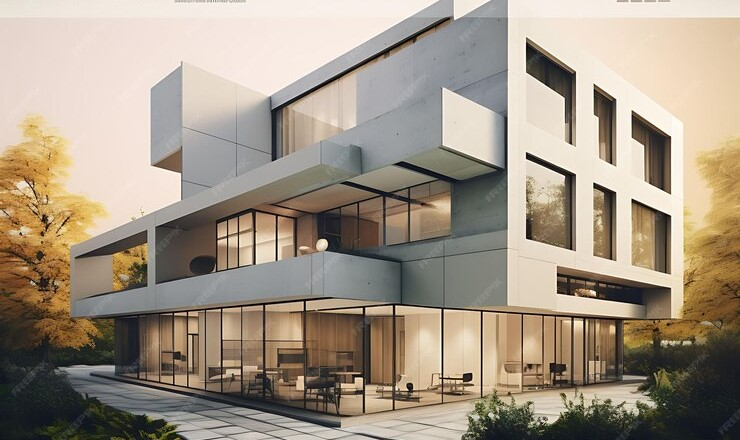
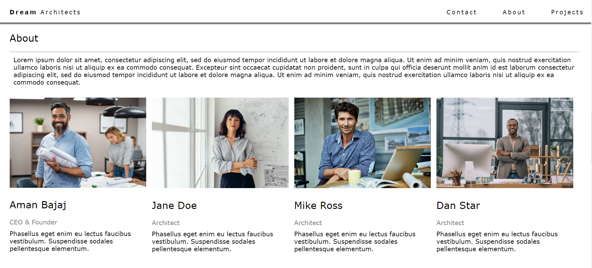
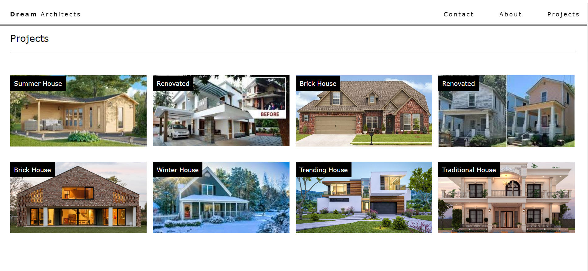
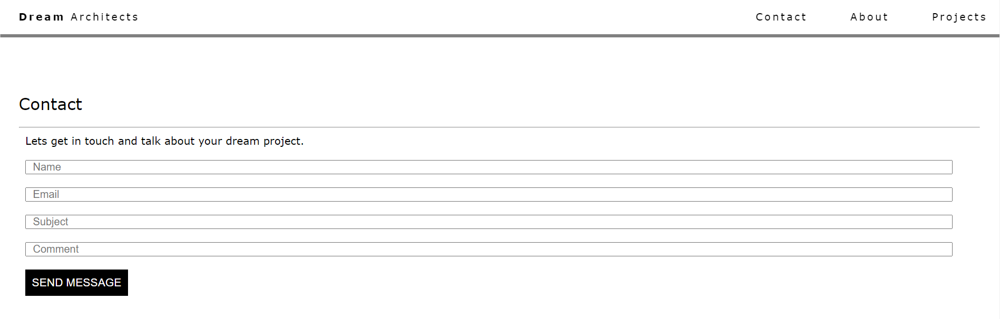

# Welcome 🖐 to the Architecture Website Template
It is a simple static Architecture Website Template.

## Have a look 
`HomePage`


`About`


`projects`


`contact`


<br>

![HTML]
![CSS]
![JS]

<br>

### How to use:

---

- Download or clone the repository

```
git clone https://github.com/aaradhy25tiwari/HTML-CSS-JS.git
```

- Go to the directory
- Run the index.html file
- Navigate the website

<br>

## Happy Coding!